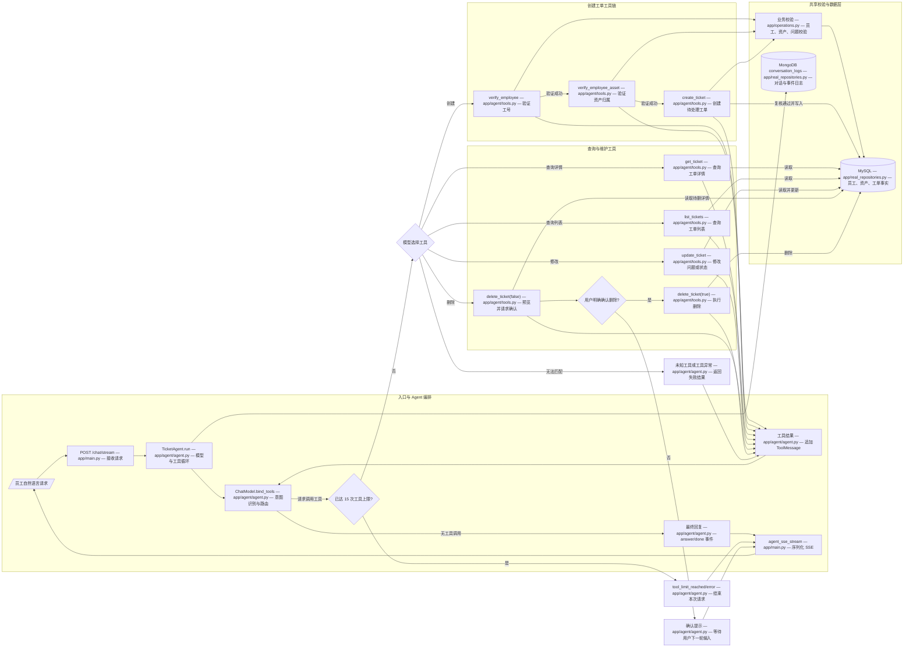

# AI 工单 Agent 流程图

下面的 Mermaid 图根据当前代码绘制，覆盖 `app/agent/tools.py` 注册的全部工具调用，以及模型路由、SSE 事件、MySQL 持久化和 MongoDB 日志链路。

## 工具调用速查

| 工具 | 实现文件 | 作用 | 关键约束 |
| --- | --- | --- | --- |
| `verify_employee` | `app/agent/tools.py` | 按工号确认员工身份 | 创建工单前必须先调用 |
| `verify_employee_asset` | `app/agent/tools.py` | 确认资产登记且属于当前员工 | 依赖已验证员工 |
| `create_ticket` | `app/agent/tools.py` | 创建 `PENDING` 待处理工单 | 依赖员工、资产和问题描述；会再次复核 |
| `get_ticket` | `app/agent/tools.py` | 按工单 ID 查询详情 | 找不到返回 `TICKET_NOT_FOUND` |
| `list_tickets` | `app/agent/tools.py` | 查询全部或指定员工的工单列表 | 可选 `employee_no` 筛选 |
| `update_ticket` | `app/agent/tools.py` | 修改问题描述或工单状态 | 至少提供一个修改字段 |
| `delete_ticket` | `app/agent/tools.py` | 删除工单 | 首次 `confirmed=false` 预览；用户明确确认后才允许 `true` |

`app/agent/agent.py` 负责绑定工具、循环调用模型、发出 `model_started` / `tool_started` / `tool_finished` / `answer` / `done` 等事件，并把过程交给 `app/main.py` 的 `/chat/stream` 以 SSE 返回。`app/real_repositories.py` 将结构化业务事实写入 MySQL，将 Agent 会话、工具中间步骤和最终状态写入 MongoDB 的 `conversation_logs` 集合。
