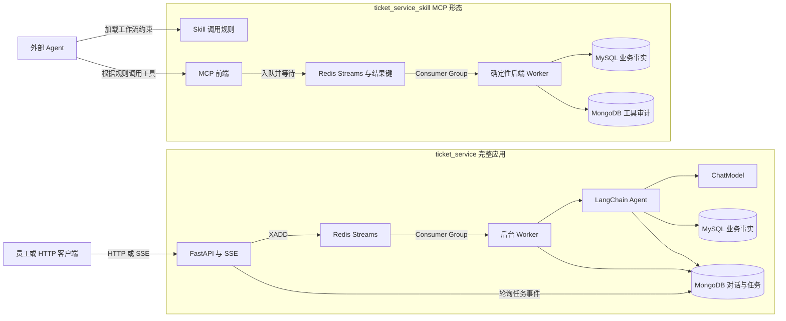
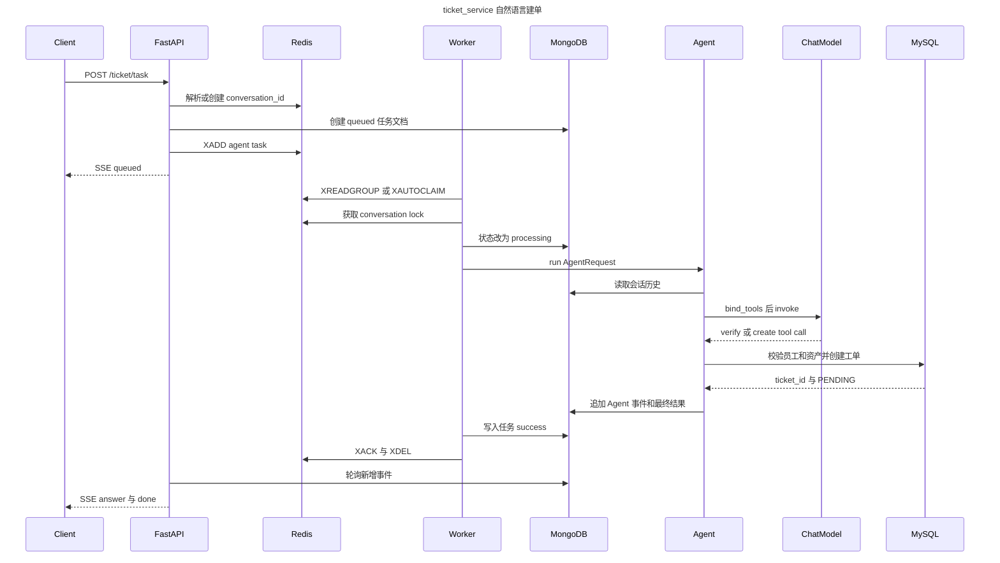
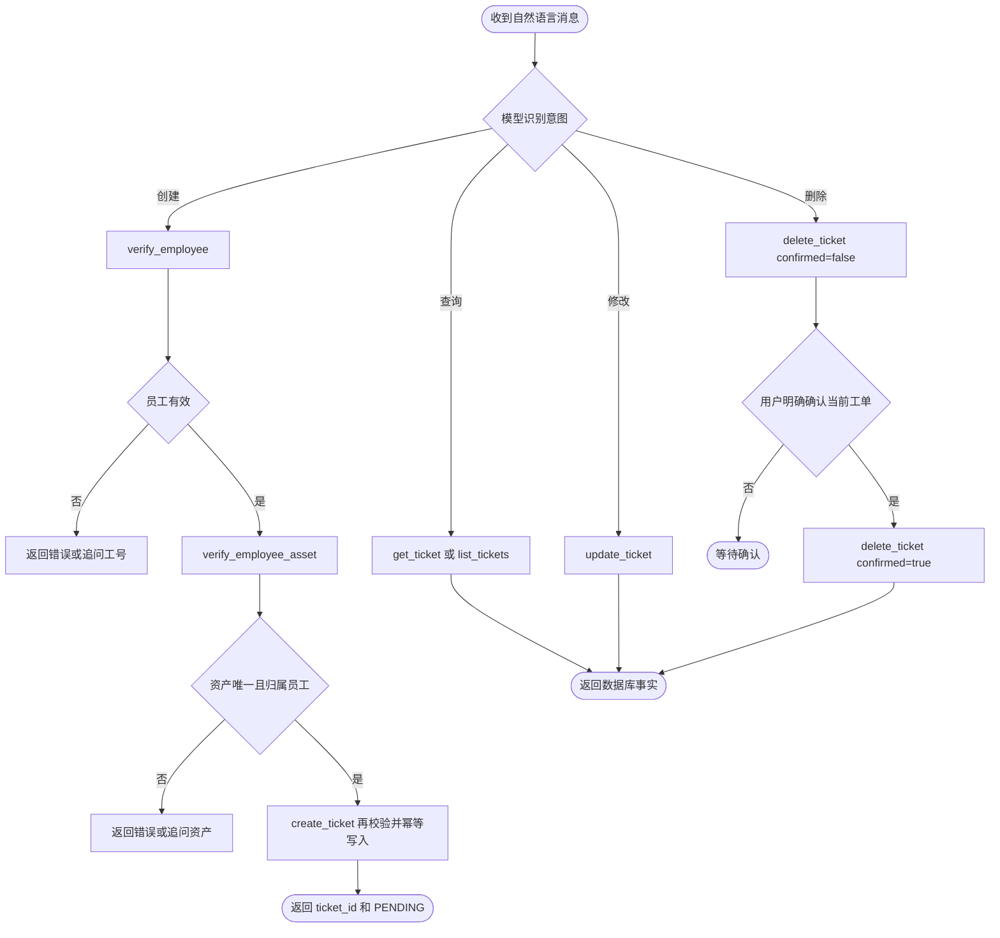
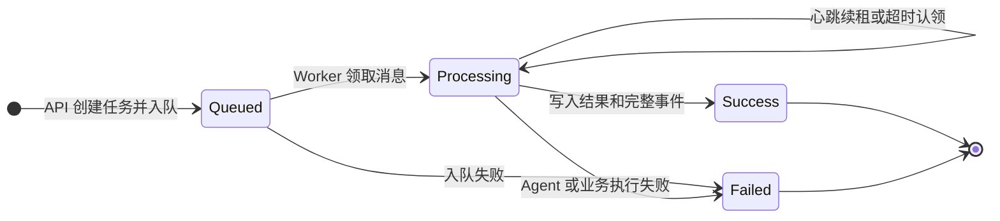
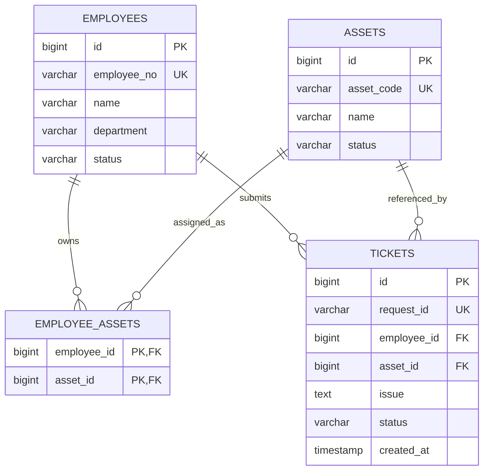
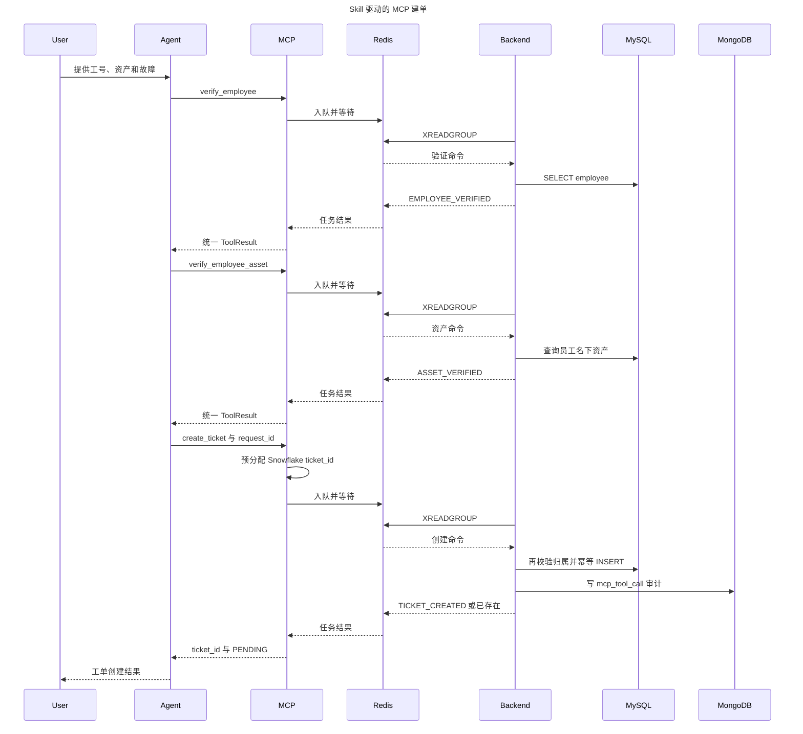
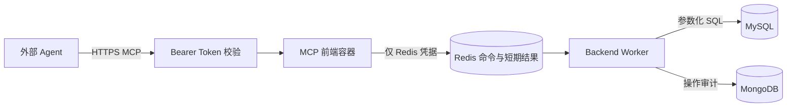

# IT 运维工单系统与 MCP Skill 技术文档

> 文档类型：As-built 技术架构说明
>
> 适用代码：`ticket_service` 与 `ticket_service_skill`
>
> 基线日期：2026-09-09

## 1. 文档目标

本文描述内部 IT 运维工单系统及其配套 Skill/MCP 工程的实际实现，包括运行边界、核心流程、数据模型、接口契约、可靠性策略、安全约束和测试方式。本文以当前代码为准，不把规划中的能力描述为已实现能力。

两个仓库提供的是两种独立运行形态：

- `ticket_service`：面向 Web、CLI 或 HTTP 客户端的完整应用。FastAPI 接收请求，Redis Streams 承载后台任务，Worker 内部运行 LangChain Agent 或结构化流程，通过 SSE 返回执行时间线。
- `ticket_service_skill`：面向外部 Agent 的 MCP 工具服务。Skill 只提供调用策略，MCP 前端只负责鉴权、参数入口、任务入队和结果等待，确定性业务逻辑与数据库访问由后端 Worker 执行。

它们可以表达相同的工单业务，但不是必须同时部署的一条串联链路。尤其要注意，两边当前的 `tickets` 表主键生成方式和部分字段约束不同，不能在未做兼容迁移与部署设计时直接共用同一套表结构。

## 2. 仓库与运行边界

| 维度 | `ticket_service` | `ticket_service_skill` |
| --- | --- | --- |
| 入口 | FastAPI HTTP/SSE、CLI | Streamable HTTP MCP `/mcp` |
| Agent 所在位置 | Worker 内部 LangChain Agent | 外部宿主 Agent |
| Skill | 无独立 Skill 包 | `skills/it-ticket-operations/` |
| 异步命令 | Redis Stream `ticket_tasks` | Redis Stream `ticket_commands` |
| 任务结果 | MongoDB `conversation_logs` | Redis 临时键 `ticket_mcp_task:{task_id}` |
| 会话历史 | MongoDB 保存对话和 Agent 事件 | 由外部 Agent/宿主维护，后端不持有完整对话 |
| 业务审计 | MongoDB 流程、对话和任务文档 | MongoDB `mcp_tool_call` 文档 |
| 工单 ID | MySQL `AUTO_INCREMENT` | MCP 前端预分配 Snowflake ID |
| 模型依赖 | DeepSeek 兼容 ChatModel 配置 | 工程内无模型调用 |

### 图 1：双仓库总体架构



## 3. 主项目 `ticket_service`

### 3.1 组件职责

- `app/main.py`：组装 FastAPI、仓储、Agent、任务队列与会话存储；负责入队、SSE 轮询转发、任务查询和会话重置。
- `worker.py`：消费 Redis Stream，根据 `task_type` 选择自然语言 Agent 或结构化 `TicketFlow`，实时把事件追加到 MongoDB，最后 ACK 并删除 Stream 消息。
- `app/agent/agent.py`：构建系统提示词和对话上下文，绑定工具，执行“模型调用—工具调用—结果回填”循环，最多允许 `MAX_TOOL_CALLS` 次工具调用。
- `app/agent/tools.py`：定义 7 个 LangChain 工具，并通过 `AgentSessionState` 保存本次执行已验证的员工、资产和已创建工单，避免模型绕过前置校验。
- `app/service.py`：实现不调用模型的结构化建单流程，复用员工、资产和问题描述校验。
- `app/real_repositories.py`：封装参数化 MySQL 访问以及 MongoDB 日志、异步任务和会话历史访问。
- `app/queue.py`：封装 Redis Consumer Group、超时任务认领、消息所有权心跳和按会话串行锁。
- `app/session.py`：维护 HttpOnly Cookie 对应的当前 `conversation_id`，默认 TTL 为 7 天。

### 3.2 HTTP 接口

| 方法与路径 | 输入 | 输出 | 说明 |
| --- | --- | --- | --- |
| `GET /health` | 无 | JSON | 返回进程健康状态与环境名 |
| `POST /ticket/stream` | `TicketRequest` | SSE | 结构化建单入口，也保留 `input_type=text` 的未启用兼容分支 |
| `POST /chat/stream` | `AgentRequest` | SSE | 单条自然语言 Agent 请求，延续 Cookie 会话 |
| `POST /ticket/task` | 单个或数组 `AgentRequest` | SSE | 单条或批量自然语言任务；批量项各自使用新的任务与对话 ID |
| `GET /ticket/task/{task_id}` | 路径参数 | JSON | 查询异步任务、事件、答案和最终工单 ID |
| `POST /chat/reset` | Cookie | JSON + Cookie | 为当前客户端生成新的对话 ID |

SSE 帧统一包含 `step`、`status`、`data`、`request_id` 和 `conversation_id`。自然语言任务首先发送序号为 0 的 `queued` 事件，之后转发 Worker 写入 MongoDB 的原始 Agent 事件。典型步骤为：

`queued → received → model_started → tool_call → tool_result → answer → done`

失败时会出现 `error` 或失败的业务步骤，并以 `done` 结束。API 轮询超过 `TASK_STREAM_TIMEOUT_SECONDS` 时发送 `TASK_STREAM_TIMEOUT`，客户端可继续调用任务查询接口，不应据此重复提交写操作。

### 图 2：主项目自然语言建单时序



### 3.3 Agent 工具与可信状态

主项目向模型绑定以下工具：

| 工具 | 关键输入 | 作用与保护 |
| --- | --- | --- |
| `verify_employee` | `employee_no` | 查询员工；员工改变时清空已验证资产 |
| `verify_employee_asset` | `asset_description` | 只能在员工已验证后调用，只匹配该员工名下资产 |
| `create_ticket` | `problem_description` | 再次校验员工与资产归属，以 `request_id` 幂等创建 `PENDING` 工单 |
| `get_ticket` | `ticket_id` | 查询单张工单 |
| `list_tickets` | 可选 `employee_no` | 查询全部或指定员工工单 |
| `update_ticket` | `ticket_id`、`issue/status` | 至少修改一个字段，状态使用固定枚举 |
| `delete_ticket` | `ticket_id`、`confirmed` | 首次返回删除预览，明确确认后才删除 |

模型负责意图匹配和选择工具，但数据库事实与执行前置条件由工具层控制。创建流程中的 `AgentSessionState` 仅存在于一次 `run` 执行期间；跨轮对话只恢复用户与助手文本，不恢复已验证对象，因此后续建单仍需重新走验证。

### 图 3：Agent 意图路由与业务保护流程



### 3.4 Redis 任务可靠性

Redis Stream 使用 Consumer Group 让多个 Worker 竞争消费。处理前后采用以下机制：

- `XAUTOCLAIM` 优先接管超过 `REDIS_PENDING_IDLE_MS` 的 Pending 消息，再用 `XREADGROUP` 读取新消息。
- `maintain_ownership` 周期性调用 `XCLAIM` 刷新消息空闲时间，防止长时间模型调用被其他 Worker 误认领。
- `serialize_conversation` 使用 `conversation_id` 哈希生成分布式锁。同一对话串行，不同对话可并行。
- 处理结束后先把终态写入 MongoDB，再执行 `XACK`；ACK 成功后尽力 `XDEL`。
- Worker 发现任务或 Agent 请求已有成功/失败终态时直接复用结果，避免重新调用模型。
- MySQL 的 `tickets.request_id` 唯一约束提供最终建单幂等保护。

### 图 4：主项目异步任务状态机



## 4. 数据设计与一致性

### 4.1 MySQL 业务事实

MySQL 保存需要约束、关联和事务处理的业务事实：员工、资产、员工资产归属和工单。主项目当前使用以下逻辑模型。

### 图 5：核心关系模型



工单状态统一为 `PENDING`、`IN_PROGRESS`、`RESOLVED`、`CANCELLED`。创建操作固定写入 `PENDING`。

两个工程的 SQL 差异必须显式管理：

| 项目 | `ticket_service` | `ticket_service_skill` |
| --- | --- | --- |
| `tickets.id` | `AUTO_INCREMENT` | MCP 预分配的 Snowflake ID |
| `request_id` | 可空但唯一 | 非空且唯一 |
| `updated_at` | 当前初始化脚本无此列 | 存在并自动更新时间 |
| 创建方式 | 插入后读取自增 ID | 携带预分配 ID 插入 |

因此，从主项目切换到 MCP 形态时，需要先确定唯一的主键策略并编写数据库迁移，不能只替换应用容器。

### 4.2 MongoDB 半结构化记录

主项目把三类文档放在 `conversation_logs` 集合：

- 结构化流程日志：`request_id`、原始 `input`、`steps`、`status`、`ticket_id/error`。
- Agent 执行日志：`conversation_id`、`request_id`、用户消息、事件数组、最终助手回复和工单 ID。
- 异步任务文档：`kind=async_task`、`task_id`、输入、状态、事件数组、答案、工单 ID 和错误。

索引覆盖异步任务唯一标识、会话历史查询和已完成 Agent 请求查询。MCP 工程不保存完整外部对话，只写 `kind=mcp_tool_call` 的业务操作审计。

### 4.3 一致性边界

MySQL 与 MongoDB 之间没有分布式事务，当前采用“业务事实优先、日志随后写入”的最终一致性方式：

- 主项目建单由 MySQL 唯一键保证重复请求不重复落单；MongoDB 用于可观察性、恢复和 SSE 转发。
- MCP 工程的创建、修改、删除先完成 MySQL 业务操作，再尝试写 MongoDB 审计。审计失败不会回滚工单，工具结果通过 `data.audit_logged=false` 暴露该事实。
- 运维排障时应以 MySQL 工单状态为业务真相，以 MongoDB/Redis 判断执行轨迹，不能用缺失日志推断业务一定未发生。

## 5. 配套 `it-ticket-operations` Skill 与 MCP 工程

### 5.1 Skill 的作用

`skills/it-ticket-operations/SKILL.md` 是外部 Agent 的工作流约束，不是可执行服务。它负责告诉 Agent：

- 创建前依次调用 `verify_employee`、`verify_employee_asset`、`create_ticket`。
- 缺少信息时追问，不猜测员工、资产或工单事实。
- 资产匹配到多个候选时，把候选交给用户选择。
- 删除必须先预览，再等待用户针对当前工单明确确认。
- 超时或网络重试复用同一个 `request_id`，避免重复建单。
- 对外只把 `ticket_id` 当作工单号，不泄露或混淆内部 `task_id`。

`agents/openai.yaml` 声明展示名称、默认提示词和名为 `itTicketService` 的 Streamable HTTP MCP 依赖。Skill 包本身不包含模型、队列实现、数据库凭据或业务数据。

### 5.2 MCP 工具契约

MCP 服务公开 8 个工具：

| 工具 | 读写属性 | 关键语义 |
| --- | --- | --- |
| `verify_employee` | 只读、幂等 | 校验员工存在且状态为 active |
| `verify_employee_asset` | 只读、幂等 | 返回零个、一个或多个匹配资产 |
| `create_ticket` | 写、幂等 | 预分配 Snowflake `ticket_id`，以 `request_id` 幂等 |
| `get_ticket` | 只读、幂等 | 按工单 ID 查询 |
| `list_tickets` | 只读、幂等 | 可按工号筛选，`limit` 为 1 到 100 |
| `update_ticket` | 写 | 修改故障描述或状态 |
| `delete_ticket` | 破坏性写 | `confirmed=false` 预览，`true` 执行 |
| `get_task_result` | 只读、幂等 | 查询超时后仍在执行的原队列任务 |

所有工具返回稳定结构：

```json
{
  "ok": true,
  "code": "STABLE_CODE",
  "message": "适合向用户解释的简短信息",
  "data": {},
  "retryable": false
}
```

常见业务码包括 `EMPLOYEE_NOT_FOUND`、`EMPLOYEE_INACTIVE`、`ASSET_NOT_FOUND`、`ASSET_AMBIGUOUS`、`TICKET_CREATED`、`TICKET_ALREADY_CREATED`、`IDEMPOTENCY_CONFLICT`、`DELETE_CONFIRMATION_REQUIRED`、`TASK_PENDING`、`QUEUE_UNAVAILABLE` 和 `BACKEND_FAILED`。

### 5.3 MCP 队列执行模型

每个业务工具都经由 Redis 执行，包括查询工具。MCP 前端生成内部 UUID `task_id`，先写 `ticket_mcp_task:{task_id}` 的 `queued` 状态，再向 Stream 追加命令。后端 Worker 仅允许执行固定操作集合，写入 `processing`、`success` 或 `failed` 结果，并在终态落地后 ACK。

结果键默认按 `REDIS_RESULT_TTL_SECONDS` 过期。等待超过 `MCP_QUEUE_TIMEOUT_SECONDS` 时：

- 创建工单返回 `TASK_PENDING` 和预分配的 `ticket_id`，之后直接使用 `get_ticket(ticket_id)` 查询；不返回内部 `task_id`。
- 其他操作返回 `TASK_PENDING` 和 `task_id`，之后调用 `get_task_result(task_id)`。

### 图 6：MCP 形态创建工单时序



### 5.4 创建幂等与冲突处理

MCP 形态在入队前生成 `ticket_id`，并把它与调用方提供的 `request_id` 一起送到后端。MySQL 使用 `request_id` 唯一约束：

- 同一 `request_id`、员工、资产和故障内容再次提交时，返回现有工单和 `TICKET_ALREADY_CREATED`。
- 同一 `request_id` 被用于不同内容时，返回 `IDEMPOTENCY_CONFLICT`，Agent 不得自动换一个键再次创建。
- 真正写入前再次查询员工状态和资产归属；发生变化时返回 `VERIFICATION_EXPIRED`。
- `TASK_PENDING` 代表结果尚未可见，不代表操作失败，不能据此重复提交。

## 6. 安全与权限边界

### 图 7：MCP 部署信任边界



建议维持以下部署约束：

- MySQL 与 MongoDB 不暴露到公网，MCP 前端不持有它们的连接凭据。
- 远程 MCP 必须配置强随机 `MCP_BEARER_TOKEN` 并使用 TLS；当前静态 Token 适合小规模内部部署，多用户环境应升级为 OAuth/OIDC。
- 当前实现没有按用户或具体写操作细分授权，拿到 Token 的调用方可以访问所有公开工具；正式环境应增加用户身份、资产范围和工具级 scope 校验。
- 工具只执行白名单业务操作与参数化 SQL，Skill 明确禁止 Agent 直连数据库或执行任意 SQL。
- 日志和错误返回不应包含 Bearer Token、数据库连接串或内部堆栈。
- 多个 MCP 实例必须配置不同的 `SNOWFLAKE_WORKER_ID`，范围为 0 到 31，避免 ID 冲突。

## 7. 配置清单

所有项目配置从各自仓库根目录 `.env` 注入，不在代码或 Skill 中保存密钥。

| 类别 | 主项目关键变量 | MCP 工程关键变量 |
| --- | --- | --- |
| MySQL | `MYSQL_HOST/PORT/DATABASE/USER/PASSWORD` | 同左，仅 Backend 使用 |
| MongoDB | `MONGO_URI/DATABASE/COLLECTION` | 同左，仅 Backend 使用 |
| Redis | `REDIS_URL/STREAM/CONSUMER_GROUP` | 同左，MCP 与 Backend 使用 |
| 可靠性 | `REDIS_PENDING_IDLE_MS`、两个心跳/锁刷新间隔 | `REDIS_PENDING_IDLE_MS`、`REDIS_HEARTBEAT_INTERVAL_SECONDS`、`REDIS_RESULT_TTL_SECONDS` |
| 模型 | `MODEL_PROVIDER`、`DEEPSEEK_MODEL/API_KEY/BASE_URL` | 无模型变量 |
| MCP | 不适用 | `MCP_HOST/PORT/PUBLIC_URL/BEARER_TOKEN` |
| ID | MySQL 自增 | `SNOWFLAKE_WORKER_ID` |

关键约束：Redis Pending 超时时间必须大于消息所有权心跳间隔；主项目的会话锁超时必须大于锁刷新间隔。

## 8. 部署与运维

### 8.1 主项目

完整容器环境由 `docker-compose.yml` 启动 API、多个 Worker、MySQL、迁移任务、MongoDB 和 Redis。`mysql-migrate` 在 API/Worker 启动前升级已有数据卷。Adminer 与 Mongo Express 仅用于受控开发环境的数据检查。

```powershell
docker compose up -d --build api worker mysql mongo redis
```

### 8.2 MCP 工程

MCP 与 Backend 必须保持凭据分离。开发环境可以整体启动，也可以分别运行服务端和 Worker。

```powershell
python -m pip install -e ".[test]"
docker compose up -d mysql mongo redis
python -m ticket_mcp.worker
python -m ticket_mcp.server
```

### 8.3 可观察性与排障顺序

1. 先用健康检查或 MCP 握手确认入口可达。
2. 查看 Redis Stream 的 Pending、Consumer 和消息所有权，判断是否有 Worker 卡住或反复认领。
3. 主项目按 `task_id/request_id/conversation_id` 查询 MongoDB；MCP 形态按 `task_id` 查询 Redis 结果键。
4. 最后以 MySQL 的工单记录确认业务操作是否已经发生。
5. 若 MySQL 已成功而 MongoDB 无审计，按“审计补偿”处理，不重复执行业务写操作。

## 9. 测试与验收

主项目测试覆盖 Agent 路由、工具前置条件、结构化建单、SSE、异步任务、OpenAPI、队列重试与并发语义。MCP 工程测试覆盖工具发现、鉴权配置、Skill 元数据、确定性业务规则、队列、Worker、Snowflake ID 和项目部署边界。

```powershell
# ticket_service
pytest -q

# ticket_service_skill
pytest -q
python C:\Users\Endless\.codex\skills\.system\skill-creator\scripts\quick_validate.py skills\it-ticket-operations
```

文档验收至少确认：

- Mermaid 代码块成对闭合，且包含架构流程图、业务流程图、时序图、ER 图和状态图。
- 接口、工具名、状态枚举、Redis Stream 名称与当前代码一致。
- 主项目与 MCP 形态的工单 ID、任务结果存储和 Agent 边界没有混写。

## 10. 已知限制与后续建议

- 两个工程的 MySQL 初始化脚本存在主键策略差异；若计划共库或平滑切换，应先统一 DDL 和迁移方案。
- 主项目通过轮询 MongoDB 转发 SSE，任务量增大后可考虑 Redis Pub/Sub、Streams 消费或 Change Streams，降低高频轮询成本。
- MongoDB 与 MySQL 没有跨库事务；可增加 Outbox、审计补偿任务和失败告警。
- 主项目的 Agent 历史只恢复用户/助手文本，不恢复可信验证状态；这是安全取舍，但多轮建单可能产生重复验证开销。
- MCP 静态 Bearer Token 没有用户级授权和写操作 scope 隔离；生产部署前应接入组织身份系统。
- 资产匹配目前主要基于名称或资产编号的包含关系。MCP 形态能返回歧义候选，主项目只取第一个匹配项；主项目可补齐显式歧义处理以降低误选风险。
- 主项目 README 首行仍保留“无 AI”的早期描述，但自然语言 LangChain Agent 已实际实现；建议后续统一项目定位文字。

## 11. 关键源码索引

### `ticket_service`

- `app/main.py`：HTTP/SSE 入口与任务编排
- `worker.py`：后台任务消费
- `app/agent/agent.py`：LangChain 调用循环
- `app/agent/tools.py`：Agent 工具与可信状态
- `app/real_repositories.py`：MySQL/MongoDB 仓储
- `app/queue.py`：Redis Streams、心跳与会话锁
- `mysql/init.sql`、`mysql/migrate.sql`：关系模型与迁移

### `ticket_service_skill`

- `skills/it-ticket-operations/SKILL.md`：Agent 工作流规则
- `skills/it-ticket-operations/references/tool-contracts.md`：工具返回码与副作用
- `skills/it-ticket-operations/agents/openai.yaml`：Skill 元数据与 MCP 依赖
- `ticket_mcp/server.py`：MCP 工具、注解与鉴权
- `ticket_mcp/queued_service.py`：入队、等待和超时语义
- `ticket_mcp/worker.py`：白名单命令执行
- `ticket_mcp/service.py`：确定性业务规则
- `ticket_mcp/repositories.py`：数据库访问与审计
- `ticket_mcp/ids.py`：Snowflake ID 生成
