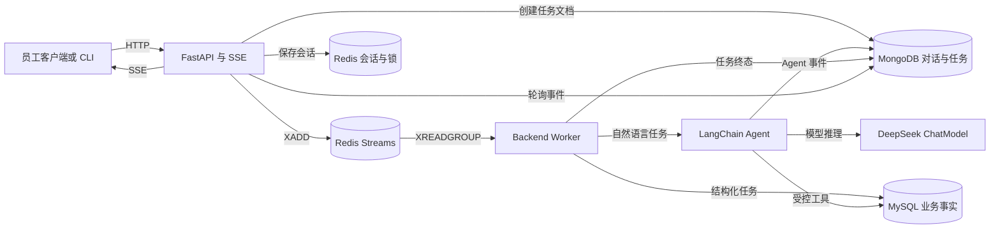
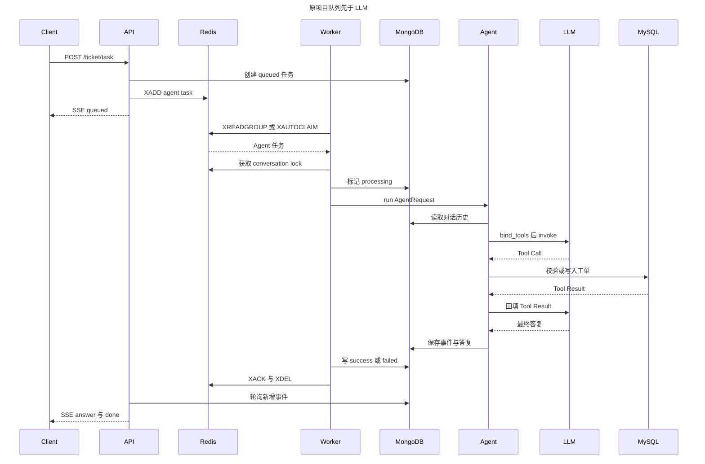
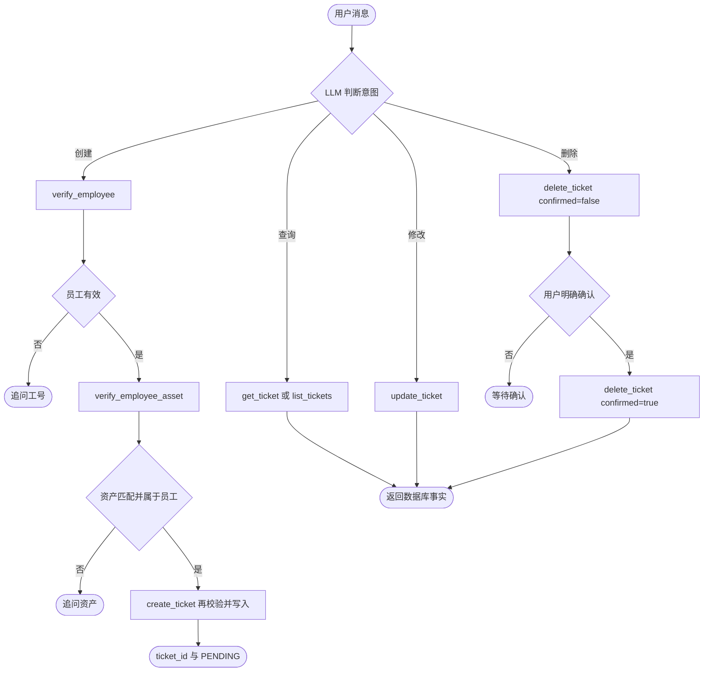
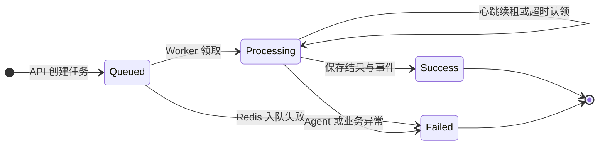
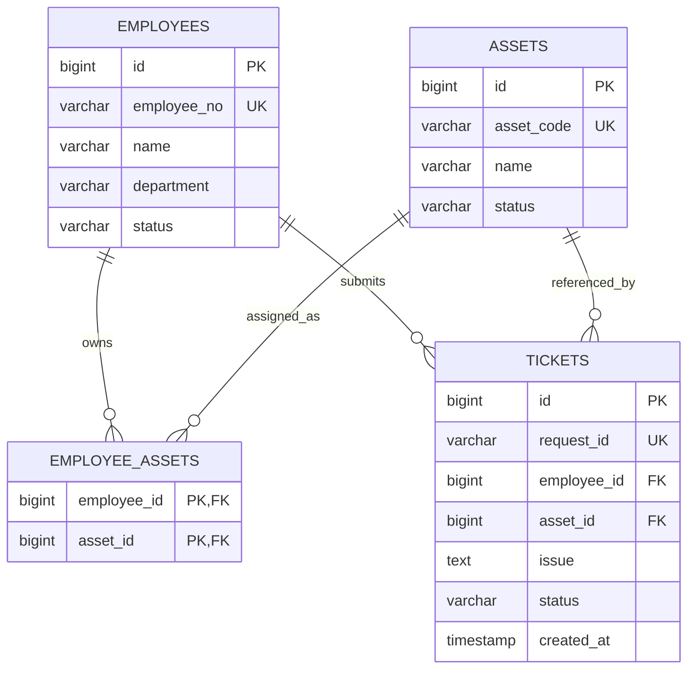

# `ticket_service` 原项目技术架构

> 基线日期：2026-09-10

## 1. 定位与关键顺序

本项目是包含 FastAPI、Redis Streams、后台 Worker、内置 LangChain Agent、MySQL 和 MongoDB 的完整 IT 运维工单应用。

核心顺序是：

`HTTP 请求 → Redis 队列 → Backend Worker → LangChain/LLM Agent → MySQL/MongoDB`

LLM 位于 Worker 内部，任务必须先入队，Worker 出队后才会初始化并调用模型。API 进程不直接调用 LLM。

## 2. 总体架构

### 图 1：组件架构



| 组件 | 代码 | 职责 |
| --- | --- | --- |
| FastAPI | `app/main.py` | 会话解析、任务创建、入队、SSE 转发、任务查询 |
| Worker | `worker.py` | 消费任务，选择 Agent 或结构化流程，更新终态并 ACK |
| Agent | `app/agent/agent.py` | 恢复历史、绑定工具、执行模型与工具循环 |
| Tools | `app/agent/tools.py` | 执行业务校验与工单增删改查 |
| TicketFlow | `app/service.py` | 不经过 LLM 的结构化建单 |
| Queue | `app/queue.py` | Consumer Group、超时认领、心跳和会话锁 |
| Repositories | `app/real_repositories.py` | MySQL 业务事实与 MongoDB 日志 |

## 3. HTTP 与 SSE

| 方法与路径 | 用途 |
| --- | --- |
| `GET /health` | 健康检查 |
| `POST /ticket/stream` | 结构化建单 SSE |
| `POST /chat/stream` | 单条自然语言 Agent SSE |
| `POST /ticket/task` | 单条或批量自然语言任务 SSE |
| `GET /ticket/task/{task_id}` | 查询异步任务状态与结果 |
| `POST /chat/reset` | 重置当前 Cookie 会话的对话 ID |

普通请求通过 HttpOnly `ticket_session_id` Cookie 维持当前 `conversation_id`。批量请求为每项创建独立任务和对话。

典型事件顺序为：

`queued → received → model_started → tool_call → tool_result → answer → done`

### 图 2：自然语言建单时序



## 4. 内置 LangChain Agent

模型根据意图选择 7 个工具：`verify_employee`、`verify_employee_asset`、`create_ticket`、`get_ticket`、`list_tickets`、`update_ticket`、`delete_ticket`。

工具层通过 `AgentSessionState` 保存本次执行的可信员工、资产和已创建工单。创建前必须先验证员工，再验证其名下资产；`create_ticket` 写入前再次校验，避免模型绕过流程或使用过期事实。每次运行最多执行 `MAX_TOOL_CALLS` 次工具调用。

### 图 3：Agent 意图与业务保护



## 5. 结构化流程

`POST /ticket/stream` 创建 `task_type=structured` 的任务。Worker 出队后调用 `TicketFlow`，不经过 LLM，依次执行员工校验、员工资产校验、MySQL 建单和 MongoDB 记录。

`input_type=text` 是保留兼容分支，会返回 `AI_NOT_ENABLED`；自然语言入口应使用 `/chat/stream` 或 `/ticket/task`。

## 6. 队列可靠性

Redis Stream 默认名为 `ticket_tasks`，Consumer Group 为 `ticket_workers`。

- `XAUTOCLAIM` 接管超时 Pending 消息，`XREADGROUP` 读取新消息。
- 处理期间周期性刷新消息所有权，避免长时间 LLM 调用被误认领。
- 同一 `conversation_id` 通过 Redis 分布式锁串行执行，不同会话可并行。
- Worker 先写 MongoDB 终态，再 `XACK`，ACK 后尽力 `XDEL`。
- 已有终态任务或 Agent 结果会直接复用，减少重复模型调用。
- MySQL `tickets.request_id` 唯一约束提供最终建单幂等保护。

### 图 4：异步任务状态



SSE 超时只表示当前连接等待超时。客户端应使用 `task_id` 查询原任务，不能直接据此重复提交写操作。

## 7. 数据设计

MySQL 保存结构化业务事实；MongoDB `conversation_logs` 保存结构化流程日志、Agent 对话/事件和 `kind=async_task` 的任务文档。

### 图 5：MySQL ER 模型



本项目的 `tickets.id` 由 MySQL `AUTO_INCREMENT` 生成。状态允许 `PENDING`、`IN_PROGRESS`、`RESOLVED`、`CANCELLED`，创建时固定为 `PENDING`。

MySQL 与 MongoDB 没有分布式事务。排障时以 MySQL 为业务真相，以 MongoDB 还原执行轨迹；若工单已存在而日志不完整，应补偿日志而不是重复建单。

## 8. 配置、部署与测试

配置统一从根目录 `.env` 注入，包括 MySQL、MongoDB、Redis、会话锁和 DeepSeek 模型参数。

```powershell
docker compose up -d --build api worker mysql mongo redis
pytest -q
```
