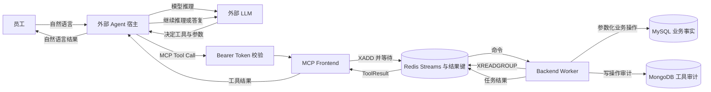
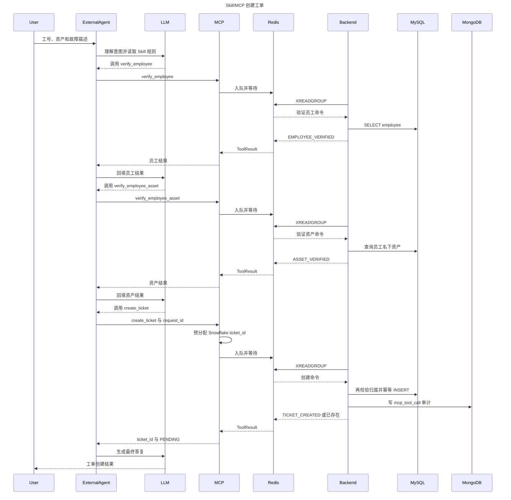
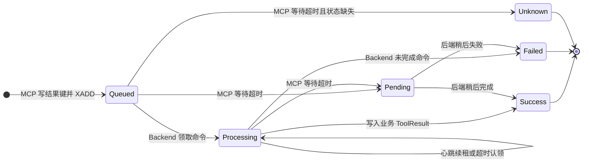
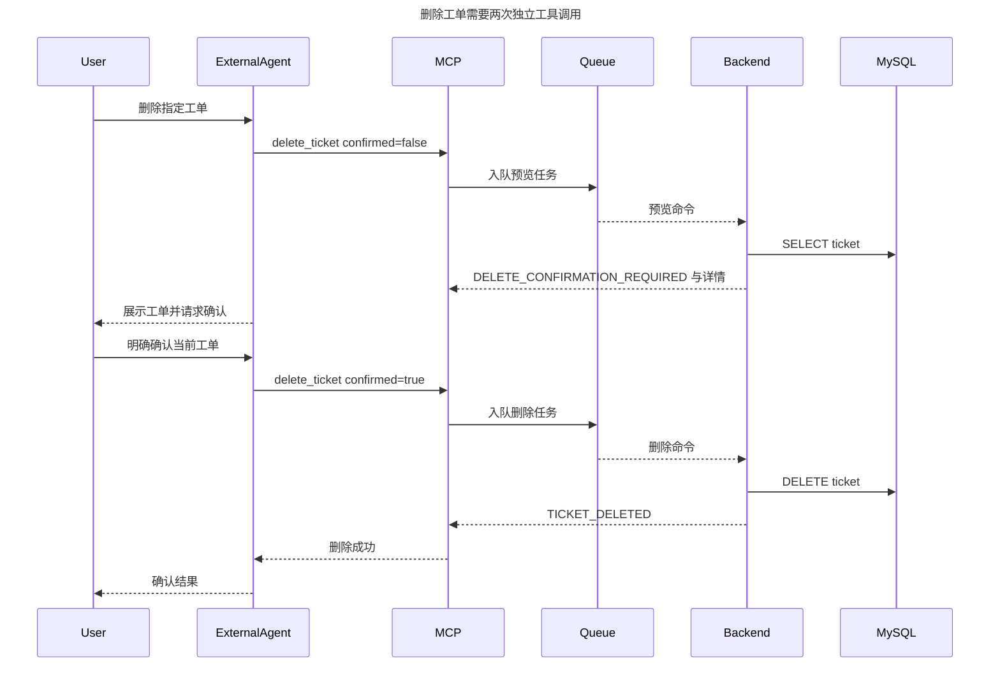
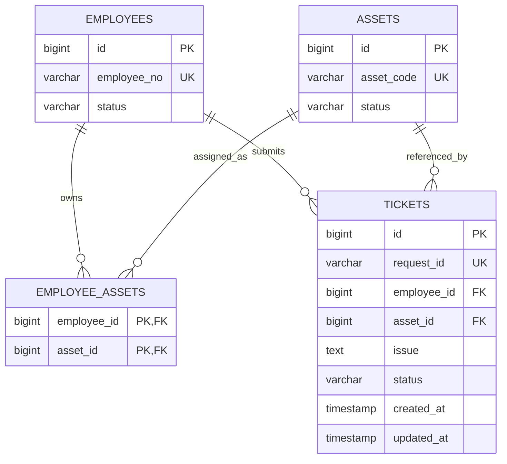

# MCP Server 技术架构

> 对应目录：`ticket_service_skill/ticket_mcp/`
>
> 基线日期：2026-09-10

## 1. 定位与关键顺序

MCP Server 把外部 Agent 推理与工单后端分离。外部 LLM 先理解用户意图并决定调用哪个工具，MCP 收到工具请求后才写入 Redis 队列。

核心顺序是：

`用户 → 外部 LLM Agent → MCP → Redis 队列 → Backend Worker → MySQL/MongoDB`

因此，这套架构是“先 LLM，后队列”。MCP 前端和 Backend Worker 都不调用 LLM；Worker 只执行白名单内的确定性业务规则。

## 2. 总体架构

### 图 1：外部 LLM 位于队列之前



| 组件 | Skill 工程位置 | 职责 |
| --- | --- | --- |
| MCP Frontend | `ticket_mcp/server.py` | 鉴权、工具定义、参数入口、入队和等待结果 |
| Queue Facade | `ticket_mcp/queued_service.py` | 生成任务 ID、预分配工单 ID、统一超时和错误语义 |
| Redis Adapter | `ticket_mcp/queue.py` | Stream 命令、短期结果键、Consumer Group 与心跳 |
| Backend Worker | `ticket_mcp/worker.py` | 消费并执行白名单业务操作 |
| TicketService | `ticket_mcp/service.py` | 确定性校验、幂等、CRUD 和审计调用 |
| Repositories | `ticket_mcp/repositories.py` | MySQL 业务数据和 MongoDB 写操作审计 |

## 3. Server 边界

每次 MCP 工具调用都是一个独立队列任务。创建工单时的员工验证、资产验证和建单不是 Worker 内的一次长事务，而是上游 Agent 根据工具结果依次发起的三个请求。`create_ticket` 会在最终写入前重新校验员工与资产归属。

Standalone Skill 如何约束上游 Agent，见 [Standalone Skill 与安装包说明](standalone-skill.md)。

## 4. MCP 工具契约

MCP 服务使用 Streamable HTTP `/mcp`，公开 8 个受控工具：

| 工具 | 属性 | 关键语义 |
| --- | --- | --- |
| `verify_employee` | 只读、幂等 | 员工必须存在且为 active |
| `verify_employee_asset` | 只读、幂等 | 返回零个、一个或多个匹配资产 |
| `create_ticket` | 写、幂等 | 预分配 Snowflake `ticket_id`，以 `request_id` 幂等 |
| `get_ticket` | 只读、幂等 | 按正整数工单 ID 查询 |
| `list_tickets` | 只读、幂等 | 可按工号过滤，`limit` 为 1 到 100 |
| `update_ticket` | 写 | 至少修改 `issue` 或 `status` 之一 |
| `delete_ticket` | 破坏性写 | 预览与确认分两次调用 |
| `get_task_result` | 只读、幂等 | 查询超时后仍在执行的原任务 |

统一返回结构：

```json
{
  "ok": true,
  "code": "STABLE_CODE",
  "message": "适合向用户解释的信息",
  "data": {},
  "retryable": false
}
```

关键错误码包括 `TOOL_INPUT_INVALID`、`EMPLOYEE_NOT_FOUND`、`EMPLOYEE_INACTIVE`、`ASSET_NOT_FOUND`、`ASSET_AMBIGUOUS`、`VERIFICATION_EXPIRED`、`IDEMPOTENCY_CONFLICT`、`DELETE_CONFIRMATION_REQUIRED`、`TASK_PENDING`、`QUEUE_UNAVAILABLE` 和 `BACKEND_FAILED`。

## 5. 创建工单时序

### 图 2：先 LLM、后队列的完整创建流程



## 6. Redis 命令与结果模型

Redis Stream 默认为 `ticket_commands`，Consumer Group 为 `ticket_backends`。MCP 为每次工具调用生成 UUID `task_id`，并使用 `ticket_mcp_task:{task_id}` 保存短期状态和结果。

### 图 3：单次工具任务状态机



`Pending` 是调用方看到的 `TASK_PENDING`，不是 Redis 内新增的持久状态；Redis 中任务仍可能是 `queued` 或 `processing`。结果默认保留 `REDIS_RESULT_TTL_SECONDS`。

创建超时时返回预分配 `ticket_id`，之后直接 `get_ticket(ticket_id)`；其他操作超时返回 `task_id`，之后调用 `get_task_result(task_id)`。不能因超时重复提交写操作。

## 7. 幂等与删除保护

创建时，MCP 先生成 Snowflake `ticket_id`，后端以 `request_id` 唯一约束幂等写入：

- 相同请求与相同内容返回 `TICKET_ALREADY_CREATED`。
- 同一 `request_id` 对应不同员工、资产或故障时返回 `IDEMPOTENCY_CONFLICT`。
- 最终写入前重新校验员工状态和资产归属，变化时返回 `VERIFICATION_EXPIRED`。

### 图 4：删除确认时序



## 8. 数据与安全边界

### 图 5：MCP 工程关系模型



该工程的 `tickets.id` 是 MCP 预分配的 Snowflake ID，`request_id` 非空且唯一。MongoDB 只记录 `kind=mcp_tool_call` 的创建、修改和删除审计，不保存外部 Agent 的完整对话。审计失败不会回滚 MySQL，结果通过 `data.audit_logged` 表示。

部署时应保持：

- MCP Frontend 只持有 Redis 连接，不持有 MySQL/MongoDB 密钥。
- Backend Worker 持有数据库连接并只执行白名单操作。
- 远程 MCP 配置强随机 `MCP_BEARER_TOKEN` 和 TLS。
- 多个 MCP 实例使用不同的 `SNOWFLAKE_WORKER_ID`，范围 0 到 31。
- 正式多用户部署使用 OAuth/OIDC 和用户级、工具级授权代替单一静态 Token。
