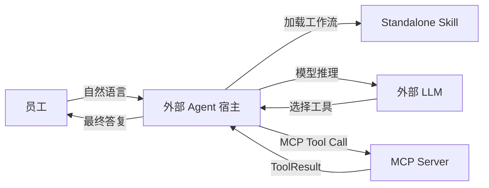
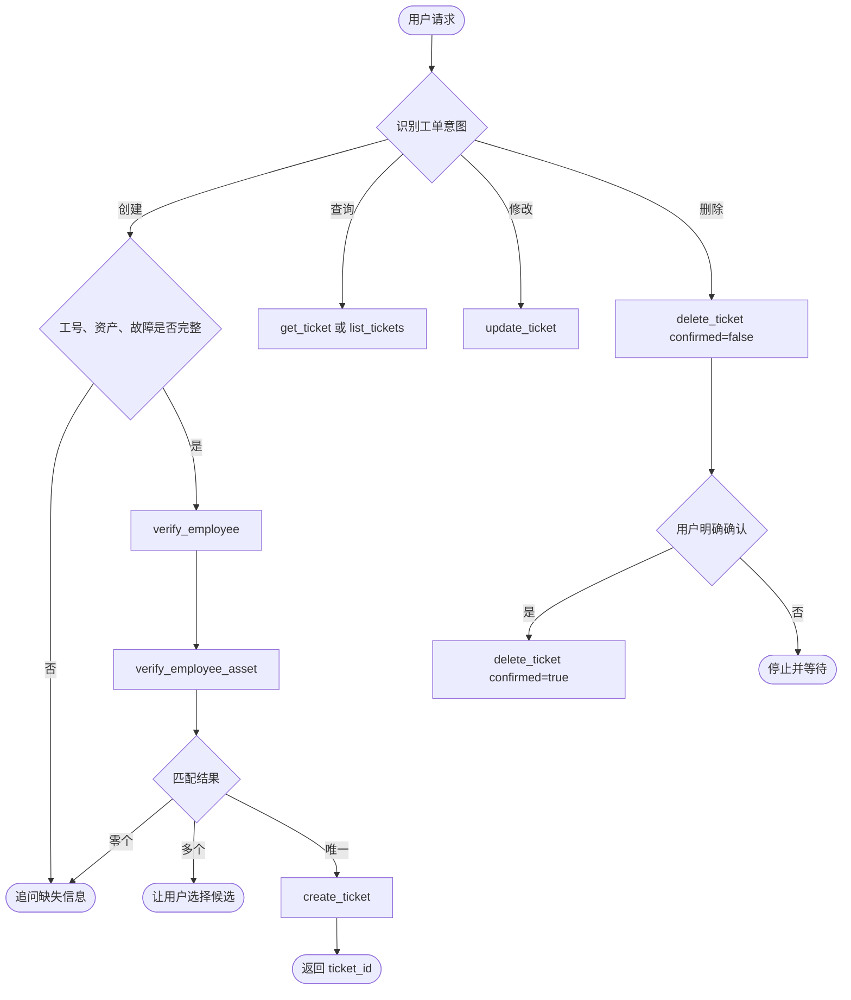

# Standalone Skill 与安装包说明

## 1. 组件定位

`skills/it-ticket-operations/` 是供外部 Agent 宿主加载的独立 Skill。它只包含工作流指令、MCP 依赖声明和工具契约，不包含 MCP Server、Redis Worker、数据库代码、模型或密钥。

Skill 与 Server 的边界如下：



LLM 运行在外部 Agent 宿主中。Skill 约束 LLM 如何收集信息、调用工具和处理错误；真正的员工、资产和工单事实由 MCP Server 返回。

## 2. Skill 目录

```text
skills/it-ticket-operations/
├── SKILL.md
├── agents/
│   └── openai.yaml
└── references/
    └── tool-contracts.md
```

- `SKILL.md`：创建、查询、修改、删除工单的 Agent 工作流。
- `agents/openai.yaml`：展示信息、默认提示词和 `itTicketService` MCP 依赖。
- `references/tool-contracts.md`：工具参数、稳定返回结构、错误码、幂等与副作用。

## 3. 安装包

仓库提供 [it-ticket-client-bundle-20260908.zip](../it-ticket-client-bundle-20260908.zip)。安装包只面向 MCP 客户端，不包含 Server 源码、Redis、Worker、数据库或真实密钥。

压缩包包含：

```text
it-ticket-client-bundle-20260908/
├── manifest.json
├── START-HERE.md
├── examples/
│   ├── codex-config.example.toml
│   ├── connection.example.json
│   └── token.example.env
└── skill/
    └── it-ticket-operations/
```

`manifest.json` 明确声明 `contains_server_source=false` 与 `contains_secrets=false`。示例 Token 文件只能保存变量名和占位说明，不能写入真实凭据。

## 4. Codex 安装流程

1. 解压安装包。
2. 把 `skill/it-ticket-operations` 复制到用户 Skill 目录：

   ```text
   C:\Users\你的用户名\.codex\skills\it-ticket-operations
   ```

3. 把管理员提供的 Token 保存到用户环境变量，不写入 Skill 或 Git：

   ```powershell
   $ticketMcpToken = Read-Host "请输入 MCP Token" -MaskInput
   [Environment]::SetEnvironmentVariable("TICKET_MCP_TOKEN", $ticketMcpToken, "User")
   ```

4. 添加已经部署好的 MCP Server：

   ```powershell
   codex mcp add it-ticket-service `
     --url https://你的MCP地址/mcp `
     --bearer-token-env-var TICKET_MCP_TOKEN
   ```

5. 完全退出并重新打开 Codex，然后先执行只读员工查询验证连接。

## 5. Agent 工作流



创建成功后只把 `data.ticket_id` 作为业务工单号。`TASK_PENDING` 不代表失败：创建任务使用预分配 `ticket_id` 查询，其他任务使用 `task_id` 调用 `get_task_result`。

## 6. 发布与校验

修改 Skill 后应同步更新安装包中的 `skill/it-ticket-operations/`，再执行：

```powershell
pytest -q
python C:\Users\Endless\.codex\skills\.system\skill-creator\scripts\quick_validate.py skills\it-ticket-operations
Get-FileHash -Algorithm SHA256 it-ticket-client-bundle-20260908.zip
```

发布前检查：

- Skill 目录与安装包中的 Skill 内容一致。
- 安装包不包含 `.env`、真实 Token、数据库凭据或 Server 源码。
- MCP URL 以 `/mcp` 结尾，远程连接使用 HTTPS。
- Token 只保存在 Agent 平台的 Secret、Credential 或环境变量中。
